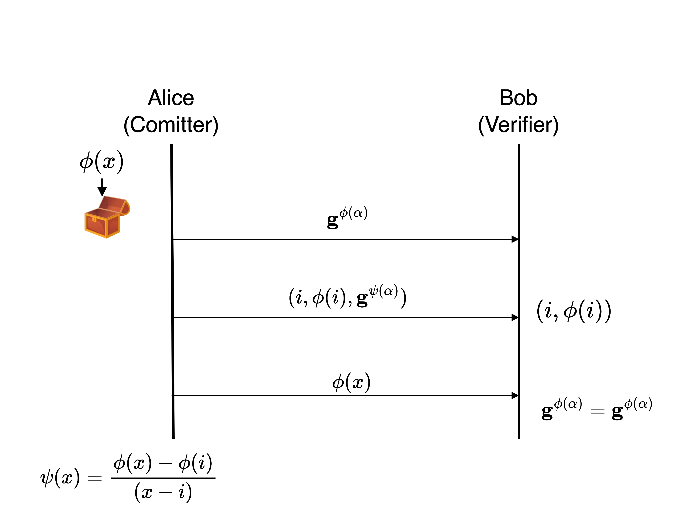
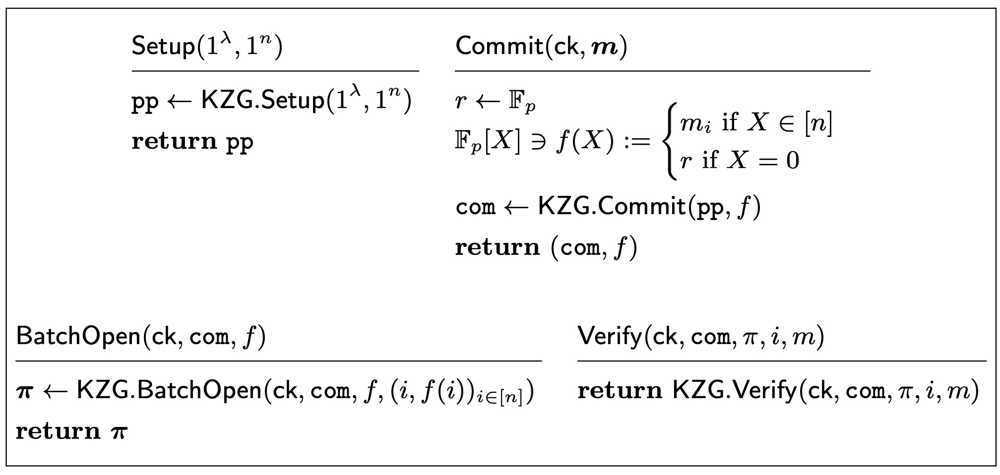
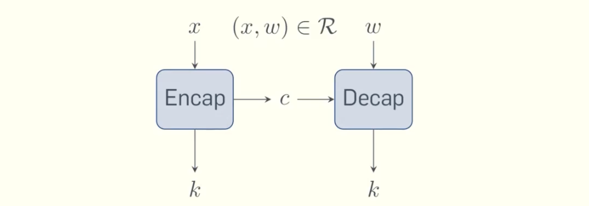
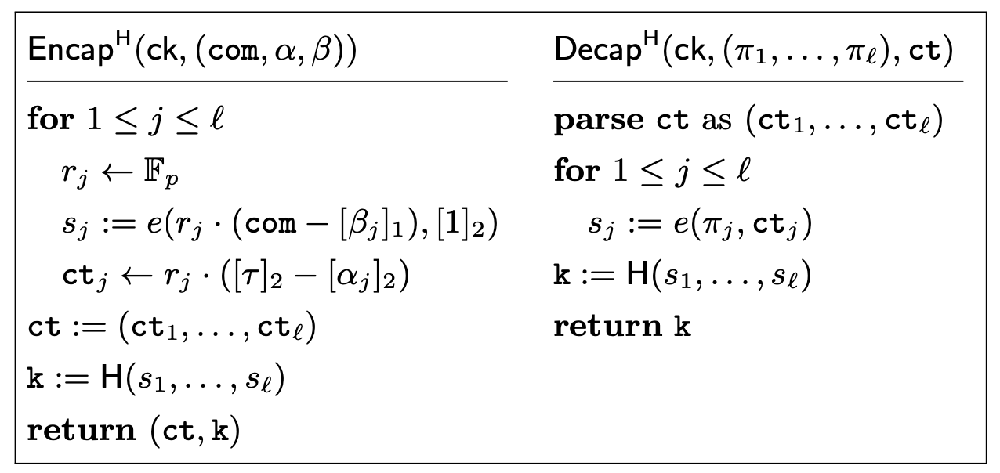
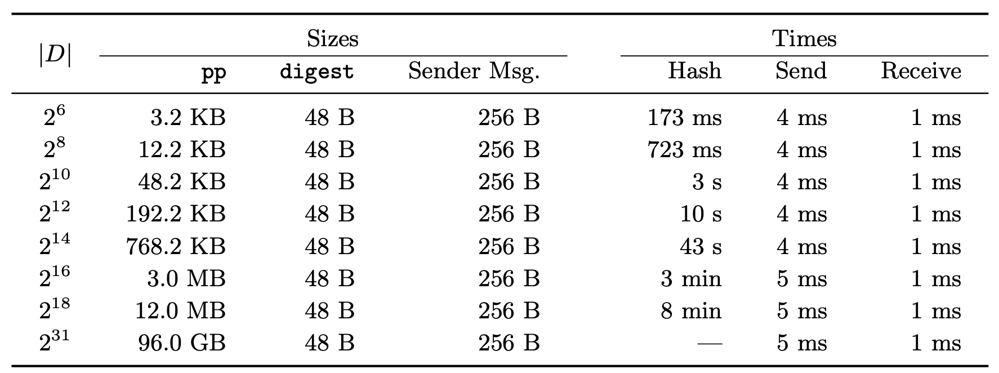

# Laconic-OT-via-KZG-Vector-Commitments

Fleischhacker, Hall-Andersen, and Simkin recently published a [paper](https://eprint.iacr.org/2024/264.pdf) on constructing efficient laconic oblivious transfer using the KZG as a vector commitment scheme. Although their OT scheme is not more efficient than state-of-the-art OT schemes for exchanging single OT instances, it outperforms every state-of-the-art OT scheme in the laconic i.e. batched case. 

## Preliminaries
Before diving into the concrete construction proposed by Fleischhacker et al. we first need to understand what it is that they achieved. In this part, we briefly discuss what (laconic) oblivious transfer is and recap the KZG polynomial commitment scheme.

### Oblivious Transfer

Oblivious Transfer (OT) is a cryptographic primitive widely used in multi-party computation (MPC). 
OT is a two-party interactive protocol between Alice and Bob. Essentially it allows Alice to give Bob a choice of two messages m0, m1, such that Bob can only choose to receive one of them (either $m0$ or $m1$) and furthermore Alice cannot know which one Bob chose. 
Laconic OT is basically a batched version of OT, it allows Alice and Bob to exchange lists of $n + 1\in \mathbb{N}$ messages $[(m0,m1), (m2,m3),..., (2n, 2n+1)]$ and choices $[b0,b1,...,bn] \in \{0,1\}^n$ in an OT manner i.e. per list-entry $i$ Bob can only receive one message ($m2i$ or $m2i+1$) and Alice cannot know which message from the list entry Bob chose ($bi$).


### KZG
The [KZG](https://www.iacr.org/archive/asiacrypt2010/6477178/6477178.pdf) is a polynomial commitment scheme. Essentially, it allows Alice to commit to a polynomial and later on reveal points of the polynomial to Bob without revealing the polynomial itself. For our purpose, the KZG has four important functions:
1. $Setup(\lambda, t) \rightarrow SRS := (g^\alpha, g^{\alpha^2},\dots,g^{\alpha^t})$

The KZG needs a trusted setup, which generates a structured reference string (SRS) that contains the information necessary to compute $g^{f(\alpha)}$ for an arbitrary polynomial $f\in\mathbb{Z}_p[X]$, where $g$ is a fixed generator of a public cyclic group $G$.

2. $Commit(SRS, \phi) \rightarrow C := g^{\phi(\alpha)}$

The commit function computes a commitment C for a given polynomial $\phi$. Intuitively, the commitment is binding because of the [Schwartz-Zippel](https://en.wikipedia.org/wiki/Schwartz–Zippel_lemma) lemma, given that $t$ is chosen sufficiently low to $p$. Note, however, as is, this construction is only hiding for uniformly randomly chosen polynomials. 

3. $CreateWitness(SRS, \phi, i) \rightarrow (i,\phi(i), \omega_i:=g^{\psi(\alpha)})$

The CreateWitness function's purpose is to reveal a single point $(i, \phi(i))$. To convince Bob that the point is indeed part of the polynomial the function computes $\omega_i := \psi(x):= \frac{\phi(x) - \phi(i)}{(x-i)}$ as a witness.

4. $VerifyEval(SRS, C, \omega_i, i, \phi(i)) \rightarrow bool$

The VerifyEval function is the counterpart to CreateWitness. Its purpose is to check that a single point $(i, \phi(i))$ is indeed on the polynomial to which $C$ is a commitment.
It performs the check using a pairing function $e$:
$$
 e(C/g^{\phi(i)},g) == e(\omega, g^\alpha/g^i)
$$



## Main Construction

The main idea behind the construction is simple. On a high level: 
Firstly, Bob commits to his choices (which Alice cannot know because of the hiding property). Then Alice computes a key based on the commitment and the possible choices and encrypts all possible messages with the key. The idea is now, that Bob can only recover the key for the choices he committed to and hence can only decrypt the messages he chose in the beginning.
Let's start with the commitment. 

### KZG Hiding Vector Commitments

Remember Bob has to commit to $n+1\in \mathbb{N}$ choices $[b0,b1,...,bn] \in \{0,1\}^n$. So how do we use the KZG, which is a polynomial commitment scheme for that? The idea is to interpolate a polynomial over the points $[(0,b0), (1,b1),\dots,(n,bn)]$, where $bi$ in $(i,bi)$ stands for the choice of Bob for the $i$-th message of Alice. We can use the KZG to commit to the interpolated polynomial, resulting in a commitment to the vector of choices of Bob. To open the vector to which we committed, we point-wise reveal all the interpolation points $[(0,b0), (1,b1),\dots,(n, bn)]$ using CreateWitness. 

However, note, that the classical KZG is only shown to be hiding for uniform random polynomials. In other words, the choices of Bob may be readable by Alice in the classical KZG scheme. Fleischhacker et al. solve this with a simple trick, they simply add a uniform random $r \overset{\$}{\leftarrow} \mathbb{Z}_p$ as an evaluation to the interpolation: $[(0,b0), (1,b1),\dots,(n, bn),(n+1,r)]$. 
Why does this work? The security proof for the classical KZG reduces the hiding game to the DL assumption. Remember, the DL assumption states given a uniformly random $r \overset{\$}{\leftarrow} \mathbb{Z}_p$ compute $r$ just from looking at $g^r$, where $g$ is a cyclic group generator of a group $G$. The main idea of the reduction proof is, that if the Adversary can break hiding and reconstruct $\phi(x)$ just from looking at the commitment, that is $g^{\phi(\alpha)}$, they can break the DL assumption. This is due to the Lagrange interpolation which allows you to rewrite $g^{\phi(\alpha)}$, such that it can be computed from a list $[(i_0,g^{\phi(i_0)}), (i_1,g^{\phi(i_1)}), \dots, (i_{deg(\phi)},g^{\phi(i_{deg(\phi)})})]$ of arbitrary points of $\phi$. Since the polynomial $\phi$ is uniform random in the classical reduction, the evaluations $\phi(i_j)$ are uniform random as well and thus any $g^{\phi(i_j)}$ is a DL instance i.e. it should be hard to get $\phi(i_j)$. However, if the Adversary breaks hiding i.e. guesses $\phi$ from $g^{\phi(\alpha)}$, they can easily compute $\phi(i_j)$ and break the DL-assumption. Hence, the classical reduction concludes that no Adversary can break hiding i.e. guess $\phi$, if DL is hard. 
What Fleischhacker et al noticed is that one does not need to choose the complete polynomial uniform random. As long as the polynomial has one uniform random evaluation, the reduction still holds. This observation allows to cheaply encode a vector in a polynomial while hiding that vector from Alice. 

Here is a short overview of the vector commitment scheme from the paper. Note they denote the SRS with pp and prepend the random evaluation r to the vector instead of appending it as described in this blog.
Furthermore, they define the function BatchOpen, which reveals all points of the committed vector at once.




Let's take a deeper look at the concrete construction of the key generation.
<!-- The main part is how the key generation works. The central idea for the key generation is that Bob can only recover the key if he knows a witness $\omega_i$ for respectively the point $(i,0)$ or $(i,1)$ and the commitment $C$, of his choices, which Alice used for the encryption. Bottom line, Bob can recover the key if and only if he knows a witness $\omega_i$ and this witness belongs to the NP relation $\mathcal{R} = \{ ((i,b_i, C), \omega_i) | i \in [n] \land VerifyEval() \}$, where n is the number of choices Bob has to make/messages Alice sends. -->

### Extractable Witness Key Encapsulation Mechanism (WKEM)


Fleischhacker et al. use a so-called extractable witness key encapsulating mechanism to generate the keys for Alice and Bob. What is that? The main idea is very simple. 
Basically, you create a scheme for an NP relation, where you derive a key for a statement and another party can derive the same key if and only if they possess the witness to your NP statement. The NP relation in the case of this work is the relation of opening points to a polynomial commitment as a statement and KZG witnesses as a witness. 

Let's take a look at the concrete scheme: 

The main idea is to derive the key from the pairing equation from _VerifyEval_: 
```math
 e(C/g^{\phi(i)},g) = e(\omega, g^\alpha/g^i)
```
The naive way, letting the key equal the value of one side of the pairing equation e.g. $k:= e(C/g^{\phi(i)},g)$ for the statement, however, is not secure as any party could derive the key from just the statement. 
Instead, the statement value is combined with a random $r\overset{\$}{\leftarrow} \mathbb{Z}_p$: $k := e(C/g^{\phi(i)},g^r)$.
<!--As one opening represents only one choice, this is of course repeated for every $n$ choices Bob has to make. The accumulated key is then a hash of the n computed $s$. -->

For any other party to obtain the same key, they have to receive the random $r$ of course somehow. However, sharing it in plain would lead to the same problem as before, any party could derive the key from the statement. That is why $r$ is sent in the form of $(g^\alpha/g^i)^r$. This is hiding $r$ as deriving $r$ would exactly be solving the DL problem for $g^\alpha/g^i$. And it allows the other party to compute the key as $k':=e(\omega, (g^\alpha/g^i)^r)$, where $\omega$ is a KZG witness. The correctness for this stems from the VerifyEval equations correctness: 

```math
\begin{aligned}
 k = e(C/g^{\phi(i)},g^r) &\overset{!}{=} e(\omega, (g^\alpha/g^i)^r) = k'\\
    \iff e(g,g)^{(\phi(\alpha) - \phi(i)) \cdot r}  &\overset{!}{=} e(g,g)^{\omega \cdot (\alpha - i) \cdot r}\\
    \iff (\phi(\alpha) - \phi(i)) \cdot r  &\overset{!}{=} \omega \cdot (\alpha - i) \cdot r\\
    \iff \phi(\alpha) - \phi(i)&\overset{!}{=} \omega \cdot (\alpha - i)\\
    \iff \phi(\alpha) &\overset{!}{=} \omega \cdot (\alpha - i) + \phi(i)\\

\end{aligned}
```
Note the 3rd equivalence holds because r is uniformly random and thus with non-negligible probability non-zero. 

Here is a graphic of the paper summarizing the scheme. Note the paper uses additive notation for group operations. Additionally, the paper displays a
version where $\alpha$ and $\beta$ are not single values, but vectors of values. We will not need this for the laconic OT construction.


Now let's put everything together!

### Laconic OT Construction

The basic Laconic OT construction is a simple combination of the two previous sections, the WKEM and the hiding KZG vector commitment scheme. 

Bob commits to a vector of his choices $D\in \{0,1\}^*$, obtaining the KZG commitment C. For each pair of messages $m_0, m_1$ Alice wants to send, she computes the keys depending on C:
```math
 k_0:= Encap(SRS, (C, i, 0)) \land k_1:= Encap(SRS, (C, i, 1))
```
and computes the according ciphertexts 
```math
 ct_0 = Encrypt(m_0, k_0) \land
 ct_1 = Encrypt(m_1, k_1)
```
Now Bob recomputes the key of his choice using the WKEM and can decrypt the according ciphertext to receive the message of his choice. 
The security follows from the hiding KZG vector commitment scheme and the WKEM. Note particularly that recomputing a key not according to Bob's choice is equivalent to breaking the KZG's binding property. 

## Benchmarks
The paper provides benchmarks from an open-source implementation which can be found [here](https://github.com/rot256/research-we-kzg).
The implementation uses the BLS12-381 elliptic curve for the pairing-friendly group for the KZG and is implemented in Rust using arkworks. The benchmarks are performed on an i7-11800H @ 2.30GHz CPU with 64 GB of RAM. The Benchmarks are performed on 256-bit messages.
Here is a graphic of the benchmarks from the paper.

D is the vector of choices of Bob i.e. how many messages are being sent and received, pp is the SRS, and the digest is the KZG commitment. The Hash is essentially the Setup of the Laconic OT.

## Sum up

We just saw how Laconic i.e batched OT can be constructed using the KZG. Bob commits to a vector of his choices _D_ using the KZG. Alice then uses a key encapsulation mechanism based on Bob's commitment to create two keys, with which she encrypts two messages. Bob is bound by the commitment to his choice and can only recompute one of the keys and hence only one message, the message of his choice.

Note that the Laconic OT outlined is a 1-of-2 OT version. However, since the _i_-th choice is committed as the evaluation of the polynomial at _i_, the construction could be just as well extended to a 1-of-n version.
