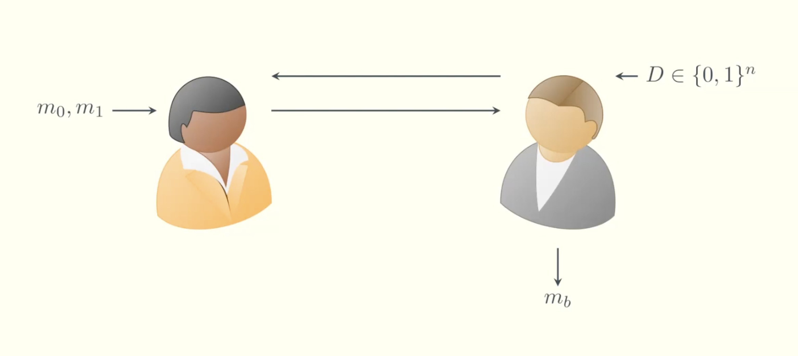

# Laconic-OT-via-KZG-Vector-Commitments

Fleischhacker, Hall-Andersen, and Simkin recently published a [paper](https://eprint.iacr.org/2024/264.pdf) on constructing efficient laconic oblivious transfer using the KZG as a vector commitment scheme. Although their OT scheme is not more efficient than state-of-the-art OT schemes for exchanging single OT instances, it outperforms every state-of-the-art OT scheme in the laconic i.e. batched case. Due to the homomorphic property of KZG commitments, multiple OT instances can be added homomorphically to one single KZG commitment, which is the main reason for the efficiency boost.

## Preliminaries
Before diving into the concrete construction proposed by Fleischhacker et al. we first need to understand what it is that they achieved. In this part, we briefly discuss what (laconic) oblivious transfer is and recap the KZG polynomial commitment scheme.

### Oblivious Transfer

Oblivious Transfer (OT) is a cryptographic primitive widely used in multi-party computation (MPC). 
OT is a two-party interactive protocol between Alice and Bob. Essentially it allows Alice to give Bob a choice of two messages m0, m1, such that Bob can only choose to receive one of them (either $m0$ or $m1$) and furthermore Alice cannot know which one Bob chose. 
Laconic OT is basically a batched version of OT, it allows Alice and Bob to exchange lists of $n + 1\in \mathbb{N}$ messages $[(m0,m1), (m2,m3),..., (2n, 2n+1)]$ and choices $[b0,b1,...,bn] \in \{0,1\}^n$ in an OT manner i.e. per list-entry $i$ Bob can only receive one message ($m2i$ or $m2i+1$) and Alice cannot know which message from the list entry Bob chose ($bi$).

### KZG
The [KZG](https://www.iacr.org/archive/asiacrypt2010/6477178/6477178.pdf) is a polynomial commitment scheme. Essentially, it allows Alice to commit to a polynomial and later on reveal points of the polynomial to Bob without revealing the polynomial itself. For our purpose, the KZG has four important functions:
1. $Setup(\lambda, t) \rightarrow SRS := (g^\alpha, g^{\alpha^2},\dots,g^{\alpha^t})$

The KZG needs a trusted setup, which generates a structured reference string (SRS) that contains the information necessary to compute $g^{f(\alpha)}$ for an arbitrary polynomial $f\in\mathbb{Z}_p[X]$, where $g$ is a fixed generator of a public cyclic group $G$.

2. $Commit(SRS, \phi) \rightarrow C := g^{\phi(\alpha)}$

The commit function computes a commitment C for a given polynomial $\phi$. Intuitively, the commitment is binding because of the [Schwartz-Zippel](https://en.wikipedia.org/wiki/Schwartz–Zippel_lemma) lemma, given that $t$ is chosen sufficiently low to $p$. Note, however, as is, this construction is only hiding for uniformly randomly chosen polynomials. 

3. $CreateWitness(SRS, \phi, i) \rightarrow (i,\phi(i), \omega_i:=g^{\psi(\alpha)})$

The CreateWitness function's purpose is to reveal a single point $(i, \phi(i))$. To convince Bob that the point is indeed part of the polynomial the function computes $\psi(x):= TODO$ as a witness.

4. $VerifyEval(SRS, C, \omega_i, i, \phi(i)) \rightarrow bool$

## Main Construction

The main idea behind the construction is simple. On a high level: 
Firstly, Bob commits to his choices (which Alice cannot know because of the hiding property). Then Alice computes a key based on the commitment and the possible choices and encrypts all possible messages with the key. The idea is now, that Bob can only recover the key for the choices he committed to and hence can only decrypt the messages he chose in the beginning.
Let's start with the commitment. 

### KZG Hiding Vector Commitments

Remember Bob has to commit to $n+1\in \mathbb{N}$ choices $[b0,b1,...,bn] \in \{0,1\}^n$. So how do we use the KZG, which is a polynomial commitment scheme for that? The idea is to interpolate a polynomial over the points $[(0,b0), (1,b1),\dots,(n,bn)]$, where $bi$ in $(i,bi)$ stands for the choice of Bob for the $i$-th message of Alice. We can use the KZG to commit to the interpolated polynomial, resulting in a commitment to the vector of choices of Bob.

However, the classical KZG is only shown to be hiding for uniform random polynomials. In other words, the choices of Bob may be readable by Alice in the classical KZG scheme. Fleischhacker et al. solve this with a simple trick, they simply add an uniform random $r \overset{\$}{\leftarrow} \mathbb{Z}_p$ as an evaluation to the interpolation: $[(0,b0), (1,b1),\dots,(n,bn),(n+1,r)]$. 
Why does this work? The security proof for the classical KZG reduces the hiding game to the DL assumption. Remember, the DL assumption states given a uniformly random $r \overset{\$}{\leftarrow} \mathbb{Z}_p$ compute $r$ just from looking at $g^r$, where $g$ is a cyclic group generator of a group $G$. The main idea of the reduction proof is, that if the Adversary can break hiding and reconstruct $\phi(x)$ just from looking at the commitment, that is $g^{\phi(\alpha)}$, they can break the DL assumption. This is due to the Lagrange interpolation which allows you to rewrite $g^{\phi(\alpha)}$, such that it can be computed from a list $[(i_0,g^{\phi(i_0)}), (i_1,g^{\phi(i_1)}), \dots, (i_{deg(\phi)},g^{\phi(i_{deg(\phi)})})]$ of arbitrary points of $\phi$. Since the polynomial $\phi$ is unfirom random in the classical reduction, the evluations $\phi(i_j)$ are unfirom random as well and thus any $g^{\phi(i_j)}$ is a DL istance i.e. it should be hard to get $\phi(i_j)$. However, if the Adversary breaks hiding i.e. guesses $\phi$ from $g^{\phi(\alpha)}$, they can easily compute $\phi(i_j)$ and break the DL-assumption. Hence, the classical reduction concludes that no Adversary can break hiding i.e. guess $\phi$, if DL is hard. 
What Fleischhacker et al noticed is that one does not need to choose the complete polynomial uniform random. As long as the polynomial has one uniform random evaluation, the reduction still holds. This oberservation allows to cheaply encode a vector in a polynomial while hiding that vector from Alice. 

Here is a short overview over the vector commitment scheme from the paper. Note they denote the SRS with pp and prepend the random evaluation r to the vector instead of appending it as described in this blog.
Furthemore they define the function BatchOpen, which reveals all points of the commited vector at once.

Let's take a deeper look at the concrete construction of the encryption/ decryption keys.
The main part is how the key generation works. The central idea for the key generation is that Bob can only recover the key if he knows a witness $\omega_i$ for respectively the point $(i,0)$ or $(i,1)$ and the commitment $C$, of his choices, which Alice used for the encryption. Bottom line, Bob can recover the key if and only if he knows a witness $\omega_i$ and this witness belongs to the NP relation $\mathcal{R} = \{ ((i,b_i, C), \omega_i) | i \in [n] \land VerifyEval() \}$, where n is the number of choices Bob has to make/messages Alice sends. 

### Extractable Witness Key Encapsulation Mechanism (WKEM)

